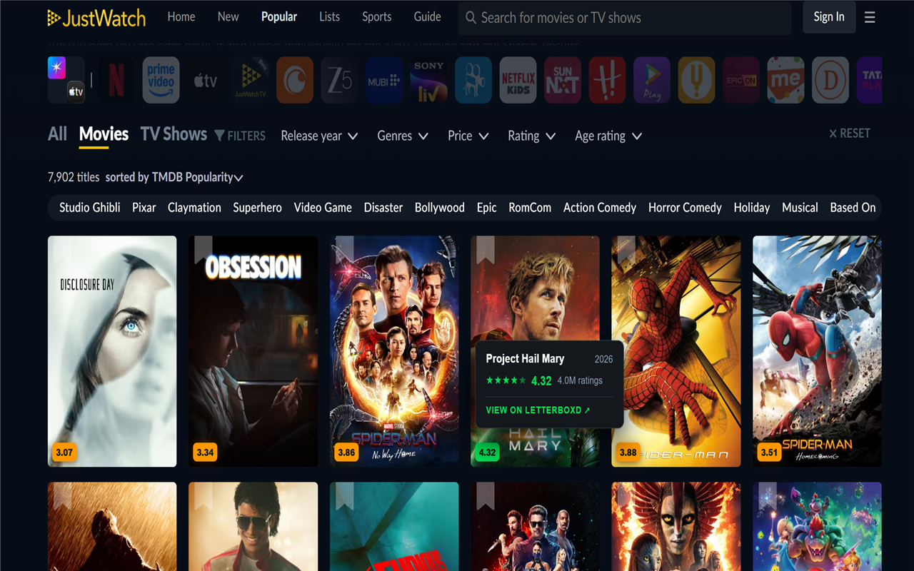
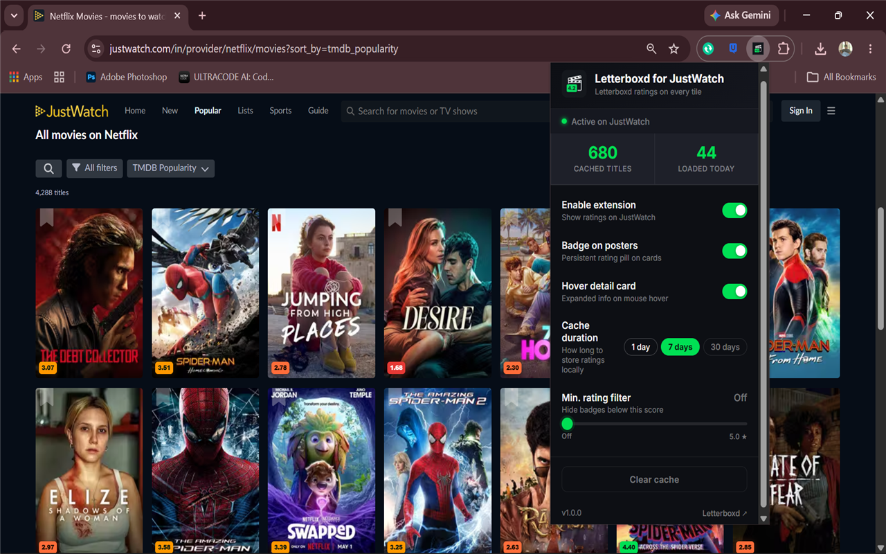

# Letterboxd Ratings for JustWatch

A Chrome extension that overlays **Letterboxd community ratings** on every movie tile as you browse [JustWatch](https://www.justwatch.com) — no clicking, no searching, no account needed.


---

## Features

- **Instant badges** — Color-coded rating pills appear automatically on every movie poster
  - 🟢 **Green** — 4.0 and above
  - 🟠 **Orange** — 3.0–3.9
  - 🟡 **Amber** — 2.0–2.9
  - 🔴 **Red** — below 2.0

- **Hover detail card** — Hover any badge to see title, year, star rating, rating count, and a direct Letterboxd link

- **Smart disambiguation** — Uses a multi-step matching system (JustWatch slug → TMDB ID → Letterboxd search) to always show the right film's rating, even for common names like "Race" or "Titanic"

- **Min. rating filter** — Slider in the popup to hide badges below a score you set (e.g. only show ≥ 3.5)

- **Smart caching** — Ratings cached locally for 1, 7, or 30 days (your choice). Repeat visits are instant

- **Privacy first** — No account, no tracking, no personal data collected

---

## Screenshots





---

## Installation

### From Chrome Web Store
[Install from the Chrome Web Store](#) *(link coming soon after review)*

### Manual install (developer mode)
1. Download or clone this repo
2. Open Chrome and go to `chrome://extensions`
3. Enable **Developer mode** (top-right toggle)
4. Click **Load unpacked** and select the repo folder

---

## How it works

```
JustWatch page loads
        ↓
Content script detects movie tiles (IntersectionObserver)
        ↓
Extracts title + year from URL slug (e.g. /movie/iron-man)
        ↓
Background worker checks local cache
        ↓ (cache miss)
Strategy 1: JW slug → letterboxd.com/film/{slug}/ (only if year in slug)
Strategy 2: TMDB API → letterboxd.com/tmdb/{id}    (primary for common names)
Strategy 3: Base slug with year verification
Strategy 4: Letterboxd search (popularity-ranked fallback)
        ↓
Result cached locally + badge injected on tile
```

---

## Project structure

```
letterboxd ratings for JustWatch/
├── manifest.json
├── background/
│   ├── background.js     # Service worker — handles messages, cache TTL
│   ├── letterboxd.js     # 4-strategy Letterboxd rating fetcher
│   └── cache.js          # chrome.storage.local TTL wrapper
├── content/
│   └── content.js        # Badge injection + hover card + IntersectionObserver
├── ui/
│   └── styles.css        # Badge + hover card styles
├── popup/
│   ├── popup.html
│   ├── popup.js
│   └── popup.css
└── icons/
    ├── icon16.png
    ├── icon48.png
    └── icon128.png
```

---

## Settings

| Setting | Description | Default |
|---|---|---|
| Enable extension | Master toggle | On |
| Badge on posters | Show rating pill on tiles | On |
| Hover detail card | Show expanded card on hover | On |
| Cache duration | 1 / 7 / 30 days | 7 days |
| Min. rating filter | Hide badges below this score | Off |

---

## Privacy

This extension does not collect any personal data. See the full [Privacy Policy](https://gist.github.com/unironic-sujal/6b6e92b7237a58f62cdf75ab24108c2a).

---

## Contributing

Issues and pull requests are welcome! If a movie is showing the wrong rating, please open an issue with:
- The movie name
- The JustWatch URL
- What rating was shown vs. what it should be

---

## License

MIT
